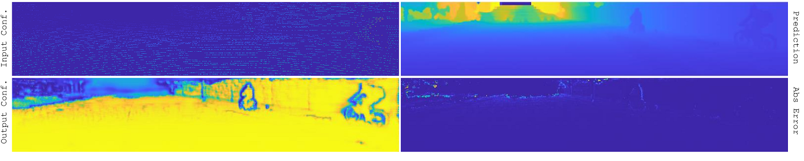

# THE PAGE IS UNDER CONSTRUCTION AND WILL BE UPDATED SOON

# Probabilistic Normalized Convolutional Neural Networks (pNCNN)

The official PyTorch implementation for "Uncertainty-Aware CNNs for Depth Completion: Uncertainty from Beginning to End" presented at CVPR 2020, Seattle, USA.

[[PDF]]() [[Supplementary]]() [[Poster]]()


```
@article{eldesokey2018propagating,
  title={Propagating Confidences through CNNs for Sparse Data Regression},
  author={Eldesokey, Abdelrahman and Felsberg, Michael and Khan, Fahad Shahbaz},
  journal={arXiv preprint arXiv:1805.11913},
  year={2018}
}
```

---

## Dependecies
The code was tested with Python 3.7.4 and PyTorch 1.4, but it should work on any PyTorch version > 1.1

* pytorch>1.1
* json
* matplotlib
* opencv
* h5py
 
---

## Datasets

### Kitti-Depth
To download the Kitti-Depth dataset, use the provided Python script `dataloaders/download_kitti_depth_rgb.py`. 

*Remeber to edit the script first to set download directories.*

### NYU-Depth-v2
Download and extract the dataset in h5 format provided from [sparse-to-dense](https://github.com/fangchangma/sparse-to-dense.pytorch#requirements).

```
wget http://datasets.lids.mit.edu/sparse-to-dense/data/nyudepthv2.tar.gz
tar -xvf nyudepthv2.tar.gz && rm -f nyudepthv2.tar.gz
```
